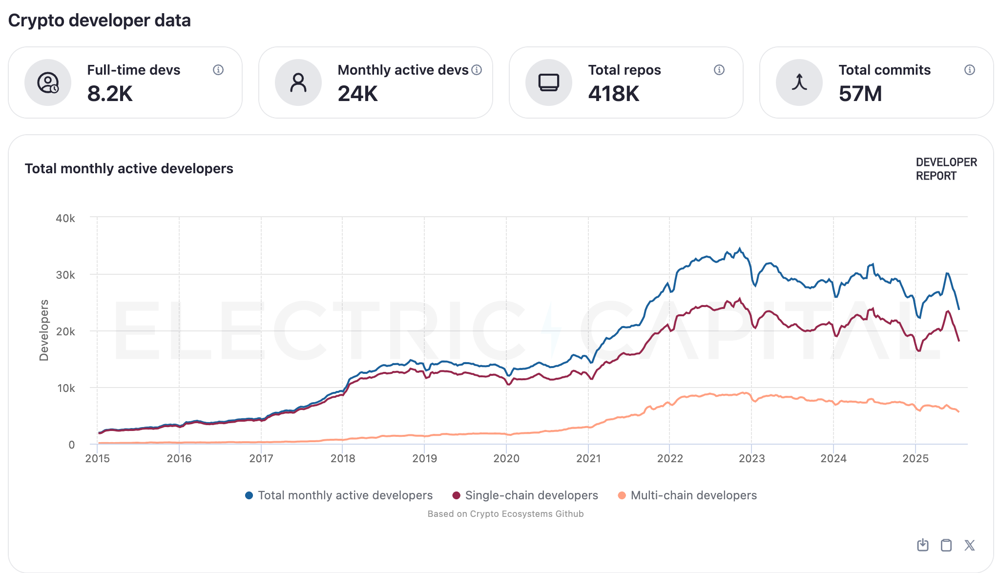

Trong quá trình phát triển ứng dụng blockchain, đặc biệt là trên Ethereum, nhiều dev đã phải đối mặt với những challenges không nhỏ từ từ việc đọc và phân tích bytecode trên **Etherscan** cho đến việc  tránh các lỗ hổng tiềm ẩn trong code Solidity.

Trong khi đa số lập trình viên quen thuộc với các ngôn ngữ như Rust, C++ hoặc Python.. thì việc bắt đầu tiếp cận Solidity và môi trường EVM đòi hỏi một quá trình học tập và làm quen không hề dễ dàng.

# Motivation for Arbitrum Stylus

Arbitrum Stylus được sinh ra để giải quyết hai vấn đề: 

* Blockchain khó tiếp cận với dev truyền thống 
* Smart contract thì execute chậm.

Theo báo cáo Developer Report của **Electric Capital**, hiện tại chỉ có khoảng 24,000 dev hoạt động hàng tháng trong mảng blockchain tính từ thời điểm mình viết bài này.

Nghe thì có vẻ ổn, nhưng nếu so với hàng triệu (thậm chí chục triệu) dev đang dùng các ngôn ngữ như Rust hay C++ ngoài kia thì… vẫn còn cách biệt quá lớn. Khi Web3 càng mở rộng, nhu cầu onboard hàng triệu dev mới vào web3 developer đang trở thành bài toán cho Devrel như tụi mình 🥲. 

 Và cách hiệu quả nhất để kéo dev truyền thống vào blockchain chính là cho họ dùng lại những ngôn ngữ họ đã quen thuộc như Rust hoặc C++. Nhiều hệ sinh thái non-EVM như Solana, Cosmos đã đi theo hướng này, với Rust gần như trở thành "tiêu chuẩn" để viết smart contract.

Còn bên EVM, trước giờ vẫn phải xài Solidity. Nhưng giờ thì khác rồi, vì **Arbitrum Stylus** cho phép dev viết smart contract bằng Rust hoặc C++ và deploy thẳng lên chain **EVM-compatible** như thường. Một step cho phép ể xóa bỏ rào cản ngôn ngữ và mở cửa cho dev web2.

# Làm sao để "Smart Contract Execution" có thể hiệu quả hơn ? 

Khi các ứng dụng phi tập trung (dApps) bắt đầu scale, nhu cầu xử lý on-chain cũng tăng theo đặc biệt là trên **Ethereum**. Nhưng cũng chính nhờ áp lực này mà nhiều làn sóng sáng tạo để scale blockchain đã nổ ra và **Arbitrum** là một trong những cái tên nổi bật  với loạt solutions như [**Arbitrum One (Layer2 chain)**](https://arbitrum.io/rollup)  và công nghệ [**Arbitrum Nitro**](https://docs.arbitrum.io/how-arbitrum-works/a-gentle-introduction).

Nếu như các giải pháp trước chủ yếu tối ưu theo kiểu **gộp nhiều transaction lại** (inter-transactional optimization), thì Stylus sẽ tối ưu từng **transaction được xử lý từ bên trong** (intra-transactional).

Cụ thể hơn, Stylus cho phép **smart contract chạy bằng WebAssembly (WASM)**. Với kết quả này thì Contract Stylus sẽ có thể chạy nhanh hơn nhiều lần, giúp **giảm gas**

# Github assignments 

I have prepared the basic challenges for builders participating in the Arbitrum workshop: [https://github.com/vbi-academy/stylus-workshop-basic](https://github.com/vbi-academy/stylus-workshop-basic)

# Reference: 

[1]: 
[2]. 